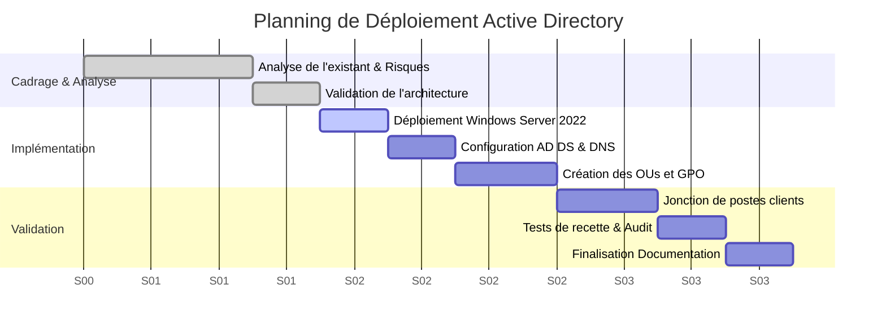

# RP03 - Annuaire d'Entreprise (Active Directory)

> 🌐 **Aperçu Visuel :** Retrouvez une présentation illustrée de ce projet sur mon portfolio : [edib16.github.io/Portfolio/#RP03](https://edib16.github.io/Portfolio/#RP03)

> **Auteur :** Edib Saoud
> **Date :** 01/2025
> **Contexte :** Projet BTS SIO SISR - IRIS Mediaschool

## 1. Contexte du Projet

Ce projet a été réalisé en première année de BTS SIO afin de répondre à un besoin critique d'infrastructure : l'absence d'authentification centralisée sur le réseau pédagogique. Chaque utilisateur gérait ses accès localement, rendant impossible la traçabilité et l'application globale de règles de sécurité.

L'objectif était de concevoir et de déployer un contrôleur de domaine sous **Windows Server 2022** utilisant les services **Active Directory (AD DS)** pour unifier la gestion des étudiants, professeurs et administrateurs du campus.

## 2. Sommaire de la Documentation

1. [Dossier de Choix Technique](01_DOSSIER_CHOIX_TECHNIQUE.md) : Analyse des besoins et justification de l'architecture Microsoft (AD DS / DNS).
2. [Procédure d'Installation](02_PROCEDURE_INSTALLATION.md) : Déploiement du serveur `SRV1-DC`, configuration du domaine `Iris.local` et des OUs.
3. [Mode Opératoire](03_MODE_OPERATOIRE.md) : Guide d'exploitation pour la création d'utilisateurs et l'intégration de postes clients.
4. [Cahier de Recette](04_CAHIER_DE_RECETTE.md) : Validation des authentifications et du bon fonctionnement des GPO.

## 3. Compétences SISR Mobilisées (Blocs BTS SIO)

| Bloc de Compétences | Compétences spécifiques validées dans ce projet | Preuves / Exemples concrets |
|:---|:---|:---|
| **Bloc 1 : Support et mise à disposition de services informatiques** | **Gérer le patrimoine informatique** | Installation et configuration d'un serveur Windows Server 2022 et du rôle AD DS. |
| | **Répondre aux incidents et demandes d'assistance** | Création de procédures de réinitialisation de mots de passe (Mode Opératoire). |
| | **Mettre à disposition un service informatique** | Déploiement d'un service d'authentification centralisé et résolution de noms (DNS). |
| **Bloc 3 : Cybersécurité des services informatiques** | **Protéger l'identité numérique de l'organisation** | Sécurisation des sessions via Stratégies de Groupe (GPO) distinctes selon les profils (Profs, Étudiants). |

## 4. Planning de Réalisation (Diagramme de Gantt)

Le projet s'est déroulé de manière individuelle sur un cycle de 3 semaines (Cycle en V) :

